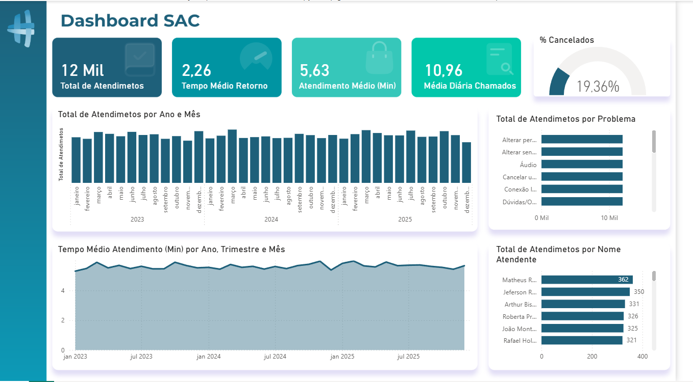

# 📊 Dashboard SAC - Power BI

## 📌 Sobre o projeto

Este dashboard foi desenvolvido para análise de atendimentos de SAC, com foco em performance operacional e tempo de resposta.

## 🎯 Indicadores principais

* Total de atendimentos
* Tempo médio de retorno
* Atendimento médio (minutos)
* Média diária de chamados
* Percentual de cancelamentos

## 📈 Análises realizadas

* Evolução mensal de atendimentos
* Tempo médio ao longo do tempo
* Ranking por tipo de problema
* Ranking por atendente

## 🛠️ Ferramentas utilizadas

* Power BI
* DAX
* Power Query

## 📷 Preview do Dashboard

## 📂 Arquivo

O arquivo `.pbix` está disponível para download neste repositório.

---

👨‍💻 Desenvolvido por Bruno Souza

